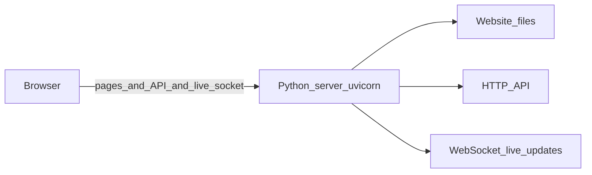
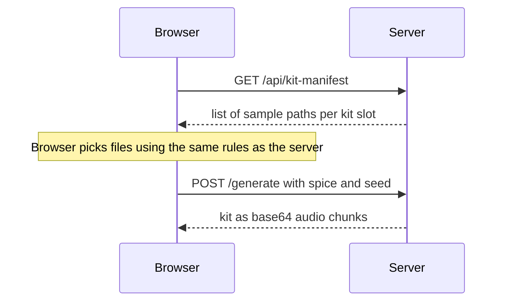
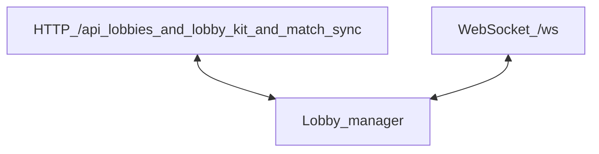

# AICookup (Beat Battle) — map for developers

This repo is one **Python server** that does three things at once: normal web requests (HTTP), live updates (WebSocket), and serving the **website files** (HTML, JS, images).

Read this page once. For **every HTTP endpoint** the server exposes, open **`/docs`** while the app is running — that page is auto-generated and stays in sync with the code.

## Run the app locally

Open a terminal in the **folder that contains** `backend/` and `frontend/` (the project root). Then run:

```bash
uvicorn backend.main:app --reload --port 8000
```

In the browser go to `http://127.0.0.1:8000/`.

**If you put the app behind nginx or another proxy:** connections can drop after about a minute if nothing keeps them alive. Uvicorn can send WebSocket “pings”; for example:

```bash
uvicorn backend.main:app --host 0.0.0.0 --port 8000 --ws-ping-interval 25 --ws-ping-timeout 120
```

Nginx also needs long enough timeouts and the right headers for WebSockets. The long comment at the top of [`backend/main.py`](../backend/main.py) explains that.

**Beat uploads:** turning uploads into small **OGG** files uses **ffmpeg** on the machine. If ffmpeg is missing, uploads fail with a server error. See the upload section in [`backend/main.py`](../backend/main.py).

## Where to see the HTTP API

With the server running, use:

| URL | What it is |
|-----|----------------|
| `http://127.0.0.1:8000/docs` | Click-and-try list of endpoints |
| `http://127.0.0.1:8000/redoc` | Same API, different layout |
| `http://127.0.0.1:8000/openapi.json` | Machine-readable API description |

You do not need to hunt every URL inside [`backend/main.py`](../backend/main.py) by hand. For a plain text list in the terminal, from the project root run: `python scripts/list_routes.py` ([`scripts/list_routes.py`](../scripts/list_routes.py)).

## What each top-level folder is for

| Folder / file | Plain English |
|---------------|----------------|
| [`backend/`](../backend/) | Server code: logins, database, solo “kit” generation, multiplayer lobbies, WebSocket chat-style updates, beat file handling |
| [`frontend/`](../frontend/) | The website: [`index.html`](../frontend/index.html), [`js/main.js`](../frontend/js/main.js), and [`js/screens/`](../frontend/js/screens/) — roughly one JS file per screen |
| [`uploads/`](../uploads/) | Saved multiplayer beats, grouped by lobby (path is set in [`backend/main.py`](../backend/main.py)) |
| [`dataset/`](../dataset/) | Audio samples for solo mode; the browser loads them from **`/media/dataset`** when that folder exists |
| [`render.yaml`](../render.yaml) | How the app is deployed on Render (install steps, env vars) |
| [`kit-manifest.json`](../kit-manifest.json) | Optional list of kit samples; how it is chosen is in [`backend/kit_manifest.py`](../backend/kit_manifest.py) |
| [`scripts/`](../scripts/) | Small helper scripts (including the route list above) |

## Big picture: one running program



**When the server starts** it creates the database if needed, makes sure `uploads/` exists, starts the multiplayer **lobby manager**, runs a background cleanup for old lobbies, and preloads the kit manifest. All of that is in the `lifespan` block in [`backend/main.py`](../backend/main.py).

**Live multiplayer** uses a WebSocket at **`/ws`**. The login token is passed as **`?token=...`** in the URL (normal browser WebSockets cannot send an `Authorization` header). You can add **`resume_player_id`** to reconnect after a drop. Code: [`backend/multiplayer/ws.py`](../backend/multiplayer/ws.py).

## How the frontend switches screens

There is **no** React Router–style path for each screen. [`frontend/js/main.js`](../frontend/js/main.js) has a function **`navigate(mountFn)`**: it removes the old screen, builds a small **`ctx`** object (API address, `navigate` itself, username, …), and runs **`mountFn(root, ctx)`**. On first load it opens **`mountModeSelectScreen`**. Where the API URL comes from: [`frontend/js/apiOrigin.js`](../frontend/js/apiOrigin.js).

Screen code lives in [`frontend/js/screens/`](../frontend/js/screens/) — for example solo, lobby, upload, cook, voting, results, login, leaderboard.

## Three main flows (how data moves)

### Solo: build a kit in the browser



HTTP handlers: [`backend/main.py`](../backend/main.py). The actual kit logic: [`backend/generator.py`](../backend/generator.py).

### Multiplayer: HTTP plus WebSocket



Examples: list lobbies, get kit meta for a lobby, **`match_sync`** to catch up if you missed WebSocket messages. Lobby rules and state: [`backend/multiplayer/`](../backend/multiplayer/).

### Uploading a beat in multiplayer


Upload HTTP code: [`backend/main.py`](../backend/main.py). Audio trimming: [`backend/beat_upload_trim.py`](../backend/beat_upload_trim.py).

## Settings file: `.env`

[`backend/database.py`](../backend/database.py) reads **`.env`** from the **project root** (the folder above `backend/`).

| Variable | What it does |
|----------|----------------|
| `DATABASE_URL` | If you set it, the app uses **Postgres**. If you leave it out, it uses **SQLite** in a file named `cookup.db` next to `backend/`. A URL starting with `postgres://` is rewritten to `postgresql://` for SQLAlchemy. |
| `COOKUP_DB_POOL_*` | Fine-tuning for Postgres connection pooling (only matters with Postgres) |
| `COOKUP_JWT_SECRET` | Secret used to sign login tokens — **use a real secret in production**; local dev has a default in [`backend/auth.py`](../backend/auth.py) |
| `BEAT_BATTLE_STATIC_BUILD` | Bumps cache for JS/CSS when you deploy (see [`backend/main.py`](../backend/main.py)) |
| `KIT_MANIFEST_PATH` | Optional path to a local JSON manifest |
| `KIT_MANIFEST_URL` | Optional URL to download a manifest. **Empty string** = do not download; use disk. **Not set at all** = production CDN default — see [`backend/kit_manifest.py`](../backend/kit_manifest.py) |

Default numbers for solo kit “stem” behaviour: [`backend/config.json`](../backend/config.json).

## “I want to change X — where do I look?”

| Goal | File or folder |
|------|----------------|
| Add or change an HTTP route, or upload size/rules | [`backend/main.py`](../backend/main.py) |
| Sign-up, login, passwords, JWT | [`backend/auth.py`](../backend/auth.py) |
| What is stored in the database | [`backend/models.py`](../backend/models.py), [`backend/database.py`](../backend/database.py) |
| Where kit sample lists come from (file, URL, or scan disk) | [`backend/kit_manifest.py`](../backend/kit_manifest.py) |
| How a solo kit is built | [`backend/generator.py`](../backend/generator.py) |
| Lobby phases, who is in a match, broadcasting updates | [`backend/multiplayer/`](../backend/multiplayer/) |
| WebSocket messages, limits, security on `/ws` | [`backend/multiplayer/ws.py`](../backend/multiplayer/ws.py) |
| Cutting uploads and writing OGG | [`backend/beat_upload_trim.py`](../backend/beat_upload_trim.py) |
| New screen or how screens hand off to each other | [`frontend/js/main.js`](../frontend/js/main.js) and [`frontend/js/screens/`](../frontend/js/screens/) |
| Multiplayer upload screen | [`frontend/js/screens/upload.js`](../frontend/js/screens/upload.js) (and nearby multiplayer screens) |
| Which server URL the browser talks to | [`frontend/js/apiOrigin.js`](../frontend/js/apiOrigin.js) |
| Production install (including ffmpeg) | [`render.yaml`](../render.yaml) |

## Tests

Automated tests are in [`backend/tests/`](../backend/tests/). [`backend/tests/conftest.py`](../backend/tests/conftest.py) clears `KIT_MANIFEST_URL` by default so tests do not download the live CDN manifest.
